# League of Legends ETL — Database Schema Diagram

Database: `yrden` (PostgreSQL)
Three schemas: `yrden` (player/game data), `lollov` (reference/LOV data), `esports` (pro esports data)

```mermaid
erDiagram

    %% ─────────────────────────────────────────
    %% SCHEMA: yrden  (transactional player data)
    %% ─────────────────────────────────────────

    yrden_people {
        serial      person_id       PK
        varchar     riot_puuid
        varchar     riot_id
        varchar     riot_key
        varchar     summoner_id
        varchar     summoner_name
        varchar     name
        boolean     YRDEN_FLAG
    }

    yrden_lol_game_data {
        varchar     game_id
        varchar     riot_puuid      FK
        varchar     riot_id
        real        game_duration
        varchar     game_mode
        int         queue_id
        varchar     game_patch
        int         champion_id
        varchar     champion_name
        varchar     lane
        int         teamid
        boolean     win
        real        kills
        real        deaths
        real        assists
        real        double_kills
        real        triple_kills
        real        quadra_kills
        real        penta_kills
        real        gold_earned
        real        champion_damage
        real        objective_damage
        real        damage_healed
        real        vision_score
        real        minions_killed
        real        neutral_monsters_killed
        int         keystone_rune_code
        int         keystone_rune_var1
        int         keystone_rune_var2
        int         keystone_rune_var3
        int         primary_rune_code1
        int         primary_rune_code2
        int         primary_rune_code3
        int         primary_rune1_var1
        int         primary_rune1_var2
        int         primary_rune1_var3
        int         primary_rune2_var1
        int         primary_rune2_var2
        int         primary_rune2_var3
        int         primary_rune3_var1
        int         primary_rune3_var2
        int         primary_rune3_var3
        int         secondary_rune_code1
        int         secondary_rune_code2
        int         secondary_rune1_var1
        int         secondary_rune1_var2
        int         secondary_rune1_var3
        int         secondary_rune2_var1
        int         secondary_rune2_var2
        int         secondary_rune2_var3
        real        largest_critical_strike
        real        nexus_kills
        int         summoner1_id
        real        summoner1_casts
        int         summoner2_id
        real        summoner2_casts
        real        control_wards_purchased
        real        wards_killed
        real        wards_placed
    }

    yrden_lol_ranked_data {
        varchar     summmoner_id
        int         person_id       FK
        varchar     puuid
        varchar     queue_type
        smallint    league_points
        varchar     tier
        varchar     rank
        smallint    wins
        smallint    losses
        boolean     hotStreak
        timestamp   ranked_load_date
    }

    yrden_lol_champ_mastery {
        varchar     puuid           FK
        varchar     summonerId
        int         championId
        int         championLevel
        int         championPoints
        int         championPointsUntilNextLevel
        int         championPointsSinceLastLevel
        boolean     chestGranted
        int         tokensEarned
        timestamp   lastplaytime
    }

    yrden_lol_challenges {
        varchar     puuid           FK
        int         challenge_id    FK
        real        percentile
        int         pos
        int         players_in_level
        varchar     challenge_level
        real        value
        timestamp   achieved_time
    }

    %% ─────────────────────────────────────────
    %% SCHEMA: lollov  (reference / LOV tables)
    %% ─────────────────────────────────────────

    lollov_lol_queues {
        int         queueId         PK
        varchar     map
        varchar     description
        varchar     notes
    }

    lollov_lol_runes {
        smallint    rune_id         PK
        varchar     rune_name
        varchar     patch_id
    }

    lollov_runes {
        int         rune_id
        varchar     rune_name
        varchar     rune_key
        varchar     category
        int         rune_slot
    }

    lollov_summoner_spells {
        int         spell_id        PK
        varchar     spell_name
        varchar     modes
    }

    lollov_lol_champions {
        int         champion_id     PK
        varchar     champion_name
        varchar     partype
        real        hp
        real        hp_per_level
        real        mp
        real        mp_per_level
        real        movespeed
        real        armor
        real        armorperlevel
        real        mr
        real        mr_per_level
        real        attackrange
        real        hp_regen
        real        hp_regen_per_level
        real        mp_regen
        real        mp_regen_per_level
        real        crit
        real        crit_per_level
        real        attack_damage
        real        attack_damage_per_level
        real        attack_speed_per_level
        real        attack_speed
        varchar     patch_no
    }

    lollov_champions {
        varchar     id              PK
        varchar     key
        varchar     name
        varchar     title
        text        blurb
        int         info_attack
        int         info_defense
        int         info_magic
        int         info_difficulty
        varchar     tags
        varchar     partype
        real        hp
        real        hpperlevel
        real        mp
        real        mpperlevel
        real        movespeed
        real        armor
        real        armorperlevel
        real        spellblock
        real        spellblockperlevel
        real        attackrange
        real        hpregen
        real        hpregenperlevel
        real        mpregen
        real        mpregenperlevel
        real        crit
        real        critperlevel
        real        attackdamage
        real        attackdamageperlevel
        real        attackspeedperlevel
        real        attackspeed
        varchar     patch_version
    }

    lollov_champions_info {
        varchar     id              PK
        varchar     key
        varchar     name
        varchar     title
        text        blurb
    }

    lollov_lol_challenges {
        int         challenge_id    PK
        varchar     name
        varchar     description
        varchar     shortdescription
        real        iron
        real        bronze
        real        silver
        real        gold
        real        platinum
        real        diamond
        real        master
        real        grandmaster
        real        challenger
    }

    %% ─────────────────────────────────────────
    %% SCHEMA: esports  (pro match data)
    %% ─────────────────────────────────────────

    esports_game_data {
        varchar     gameid
        varchar     datacompleteness
        text        url
        varchar     league
        int         year
        varchar     split
        boolean     playoffs
        date        date
        smallint    game
        varchar     patch
        smallint    participantid
        varchar     side
        varchar     position
        varchar     playername
        varchar     playerid
        varchar     teamname
        varchar     teamid
        varchar     champion
        varchar     ban1
        varchar     ban2
        varchar     ban3
        varchar     ban4
        varchar     ban5
        varchar     pick1
        varchar     pick2
        varchar     pick3
        varchar     pick4
        varchar     pick5
        real        gamelength
        boolean     result
        real        kills
        real        deaths
        real        assists
        real        teamkills
        real        teamdeaths
        real        doublekills
        real        triplekills
        real        quadrakills
        real        pentakills
        boolean     firstblood
        boolean     firstbloodkill
        boolean     firstbloodassist
        boolean     firstbloodvictim
        real        team_kpm
        real        ckpm
        boolean     firstdragon
        real        dragons
        real        opp_dragons
        real        elementaldrakes
        real        opp_elementaldrakes
        real        infernals
        real        mountains
        real        clouds
        real        oceans
        real        chemtechs
        real        hextechs
        real        dragons_type_unknown
        real        elders
        real        opp_elders
        boolean     firstherald
        real        heralds
        real        opp_heralds
        real        void_grubs
        real        opp_void_grubs
        boolean     firstbaron
        real        barons
        real        opp_barons
        boolean     firsttower
        real        towers
        real        opp_towers
        boolean     firstmidtower
        boolean     firsttothreetowers
        real        turretplates
        real        opp_turretplates
        real        inhibitors
        real        opp_inhibitors
        real        damagetochampions
        real        dpm
        real        damageshare
        real        damagetakenperminute
        real        damagemitigatedperminute
        real        wardsplaced
        real        wpm
        real        wardskilled
        real        wcpm
        real        controlwardsbought
        real        visionscore
        real        vspm
        real        totalgold
        real        earnedgold
        real        earned_gpm
        real        earnedgoldshare
        real        goldspent
        real        gspd
        real        gpr
        real        total_cs
        real        minionkills
        real        monsterkills
        real        monsterkillsownjungle
        real        monsterkillsenemyjungle
        real        cspm
        real        goldat10
        real        xpat10
        real        csat10
        real        opp_goldat10
        real        opp_xpat10
        real        opp_csat10
        real        golddiffat10
        real        xpdiffat10
        real        csdiffat10
        real        killsat10
        real        assistsat10
        real        deathsat10
        real        opp_killsat10
        real        opp_assistsat10
        real        opp_deathsat10
        real        goldat15
        real        xpat15
        real        csat15
        real        opp_goldat15
        real        opp_xpat15
        real        opp_csat15
        real        golddiffat15
        real        xpdiffat15
        real        csdiffat15
        real        killsat15
        real        assistsat15
        real        deathsat15
        real        opp_killsat15
        real        opp_assistsat15
        real        opp_deathsat15
        real        goldat20
        real        xpat20
        real        csat20
        real        opp_goldat20
        real        opp_xpat20
        real        opp_csat20
        real        golddiffat20
        real        xpdiffat20
        real        csdiffat20
        real        killsat20
        real        assistsat20
        real        deathsat20
        real        opp_killsat20
        real        opp_assistsat20
        real        opp_deathsat20
        real        goldat25
        real        xpat25
        real        csat25
        real        opp_goldat25
        real        opp_xpat25
        real        opp_csat25
        real        golddiffat25
        real        xpdiffat25
        real        csdiffat25
        real        killsat25
        real        assistsat25
        real        deathsat25
        real        opp_killsat25
        real        opp_assistsat25
        real        opp_deathsat25
    }

    %% ─────────────────────────────────────────
    %% RELATIONSHIPS
    %% ─────────────────────────────────────────

    yrden_people ||--o{ yrden_lol_game_data     : "riot_puuid"
    yrden_people ||--o{ yrden_lol_ranked_data   : "person_id (FK)"
    yrden_people ||--o{ yrden_lol_champ_mastery : "riot_puuid = puuid"
    yrden_people ||--o{ yrden_lol_challenges    : "riot_puuid = puuid"

    lollov_lol_challenges ||--o{ yrden_lol_challenges : "challenge_id"
    lollov_lol_champions  ||--o{ yrden_lol_champ_mastery : "champion_id = championId"
    lollov_lol_queues     ||--o{ yrden_lol_game_data : "queueId = queue_id (view join)"
    lollov_lol_runes      ||--o{ yrden_lol_game_data : "rune_id = *_rune_code (view join)"
    lollov_summoner_spells ||--o{ yrden_lol_game_data : "spell_id = summoner1/2_id (view join)"
```

---

## Table Inventory

### Schema: `yrden` — Transactional Player Data

| Table | Purpose | Logical Key |
|---|---|---|
| `people` | Core player registry (Riot accounts) | `person_id` (serial PK) |
| `lol_game_data` | Per-player per-game stats | `game_id + riot_puuid` |
| `lol_ranked_data` | Ranked queue snapshot per player | `person_id + queue_type` |
| `lol_champ_mastery` | Champion mastery scores per player | `puuid + championId` |
| `lol_challenges` | Riot challenge progress per player | `puuid + challenge_id` |
| `stage_lol_game_data` | ETL staging — dropped/recreated each run | transient |
| `stage_lol_challenges` | ETL staging — dropped/recreated each run | transient |
| `stage_champ_mastery` | ETL staging — dropped/recreated each run | transient |

### Schema: `lollov` — Reference / List of Values

| Table | Purpose | Notes |
|---|---|---|
| `lol_queues` | Queue ID → description mapping | From Riot `queues.json` |
| `lol_runes` | Rune ID → name (older, patch-aware) | Has `patch_id`; used in `LEAGUE_MATCH_DATA` view |
| `runes` | Rune ID → name, key, category, slot (newer) | From ddragon API via `runes_lov.py` |
| `summoner_spells` | Spell ID → name, modes | Also referenced as `LOL_SUMMONER_SPELLS` |
| `lol_champions` | Champion stats (older, patch-versioned) | Used in `CHAMPION_MASTERY` view |
| `champions` | Champion stats (newer, full ddragon) | `id` PK; from `champ_lov.py` |
| `champions_info` | Minimal champion metadata | `id` PK; from `champ_base_lov.py` |
| `lol_challenges` | Challenge definitions + tier thresholds | Dynamic columns; `challenge_id` PK |

### Schema: `esports` (also `lol`) — Pro Esports Data

| Table | Purpose | Notes |
|---|---|---|
| `game_data` / `esports_data` | Oracle's Elixir pro match CSV data | ~150 columns; at-10/15/20/25 snapshots |

---

## Views

| View | Schema | Joins |
|---|---|---|
| `LEAGUE_MATCH_DATA` | `yrden` | `lol_game_data` → `people` → `lol_summoner_spells`, `lol_queues`, `lol_runes` (×7 rune aliases) |
| `LEAGUE_CHALLENGES` | `yrden` | `lol_challenges` → `lollov.lol_challenges` → `people` |
| `CHAMPION_MASTERY` | `yrden` | `lol_champ_mastery` → `people` → `lollov.lol_champions` |

---

## Known Issues / Notes for Recreation

- `lol_ranked_data.summmoner_id` has a **triple-m typo** in the original DDL — fix on recreation.
- `lol_champ_mastery` DDL is missing `lastplaytime` — add it (`timestamp`).
- `lollov.lol_runes` DDL is missing `patch_id` — add it (`varchar`).
- `esports.game_data` DDL is missing `pick1–5`, `void_grubs`, `opp_void_grubs`, `gpr`, and at-20/at-25 snapshot columns — add them.
- `lol_game_data` has no declared PK or indexes — consider adding a unique constraint on `(game_id, riot_puuid)`.
- `lollov.lol_challenges` columns (`iron` through `challenger`) are dynamically generated from the Riot API response — the tier column names match Riot's tier names exactly.
- `summoner_spells` vs `LOL_SUMMONER_SPELLS`: likely the same table; confirm the live name before recreating.
- `lol_champions` (older) and `champions` (newer) appear to serve the same purpose with different schemas — clarify which is authoritative.
